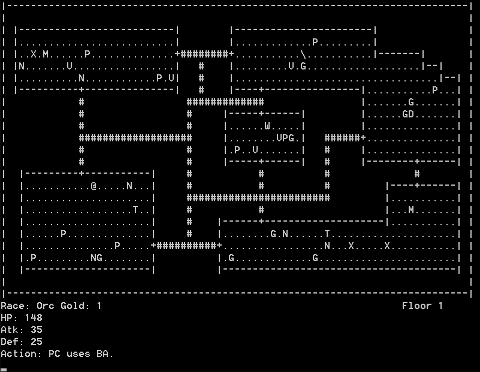

# CC3K
Co-Developed a text-based adventure game with another University of Waterloo student. First designed using UML, then implemented in C++ all in two weeks for our Object-Oriented Software Development course.

